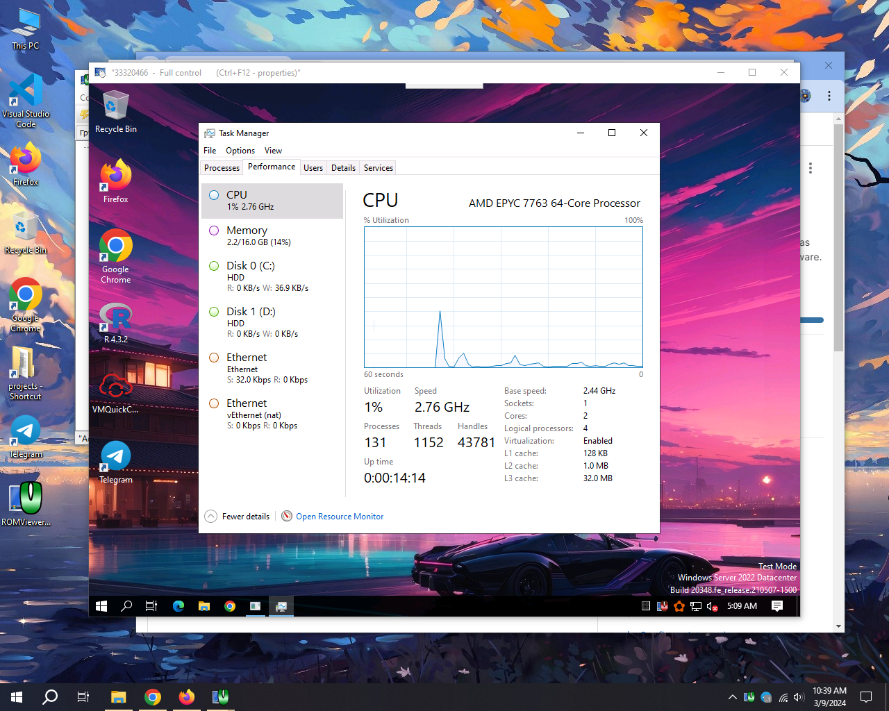

## Windows 10 Github RDP ft LiteManager

# Read This Before Rushing To Actions Tab In Github 💀

* i'm **not responsible** for **suspended github accounts**
* **Don't try these in your personal github account** or don't make emails same as your personal github email to make fake github account.
---
### Windows 10 Least

VM features:
* AMD EPYC 7763 64-Core Processor 2.44 GHz (**2 cores**)
* 16 GB RAM
* 150+255 GB Disk
* We Have Some Cool Features That Other workflows Dosen't Have
  - Automatically Telegram Installed
  - Automatically Winrar Installed
  - Automatically VM Quick Config Installed
  - Removed Stupid/Unrated Softwares
  - Added New Wallpaper
  - Profile-based Persistent Credentials
  - Automatic Restart & Resume
  - Graceful Shutdown Support
  - Fallback Credential Generation
  - Repository Bloat Protection
  - Automatic Log Rotation
  - And More...

## New Features

### Profile-based Persistence
* Create multiple independent profiles with persistent credentials
* Each profile maintains its own state and logs
* Credentials are saved and reused across runs

### Automated Workflow
* Scheduled daily runs at 10:00 IST
* Auto-restart after completion
* Graceful shutdown with stop flag
* Comprehensive logging

## Deploy and Run

    
Windows 10 RDP Install and Run

 
    
* Just **Download The Workflow** from **Release**.

* **Open Workflow** in **NotePad and Copy All** (**Ctrl+A & Ctrl+C**).
    
* **Create new Repo in Github.**

* Go to **Actions** Tab , Click **set up a workflow yourself**.

* **Paste (Ctrl+V) that copied workflow code** & click **Commit changes**...
    
* Now go to **Actions** Tab and **select workflow**.

* Click **Run Workflow** button on the left of **This workflow has a workflow_dispatch event trigger** line.

* Enter a **profile name** (e.g., "default", "mining1", etc.) and click **Run**.

* **Download & Install LiteManager Viwer Application** On Your Device **([Android/Windows/Linux/Macos](https://www.litemanager.com/download/))**

* **Copy the LiteManager ID** in your LiteManager Viwer click **Add New Connection** then **Paste ID in ID Fill**.

* **Copy LiteManager Password from The Run** & **Paste it** & **Hit Enter** (wait some connecting minutes).

* **Enjoy!**

    
Using Multiple Profiles

 

* Each profile operates independently with its own credentials and state
* To create a new profile, simply run the workflow with a different profile name
* Profiles are stored in the `miner-state/<profile>` directory
* To stop a running profile, create a file named `stop.flag` in the profile's directory

    
Using Secrets for Credentials

 

* You can set repository secrets for persistent credentials:
  - `LITEMANAGER_ID`: Your LiteManager ID
  - `LITEMANAGER_PASS`: Your LiteManager password
* When these secrets are set, they will be used instead of generating new credentials

    
Repository Bloat Protection

 

* Automatic log rotation keeps your repository size manageable
* Logs older than 3 days are automatically cleaned up
* Files larger than 1MB are excluded from git tracking
* Run `cleanup_logs.bat [profile] [days] [size_kb]` manually to clean up logs
* Example: `cleanup_logs.bat default 7 2048` cleans logs for the default profile older than 7 days or larger than 2MB

    
Fallback Credential Generation

 

* If no credentials file exists and no GitHub Secrets are provided, random credentials will be generated
* These credentials are saved to the profile's directory for future use
* This ensures the system always has valid credentials to operate with

# [Watch Tutorial If You Dosen't Understand This.](https://youtu.be/xqpCQCJXKxU)

### © 2025 KADDU. All Rights Reserved.
### You Can See ID, Username, Pass, PC Name And Cool ASCII Art